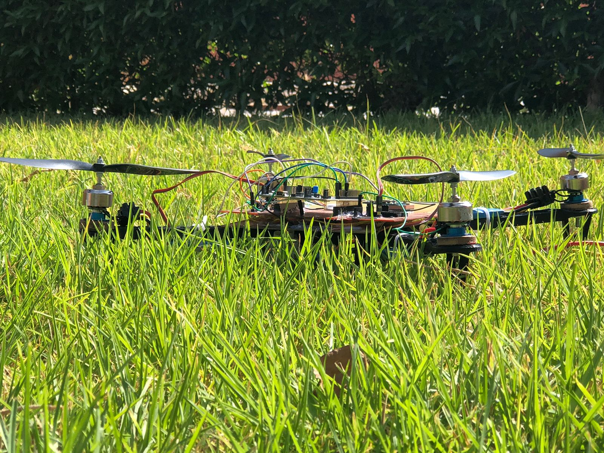
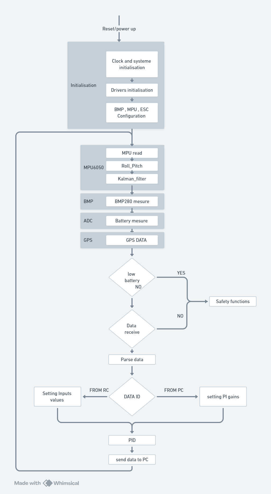
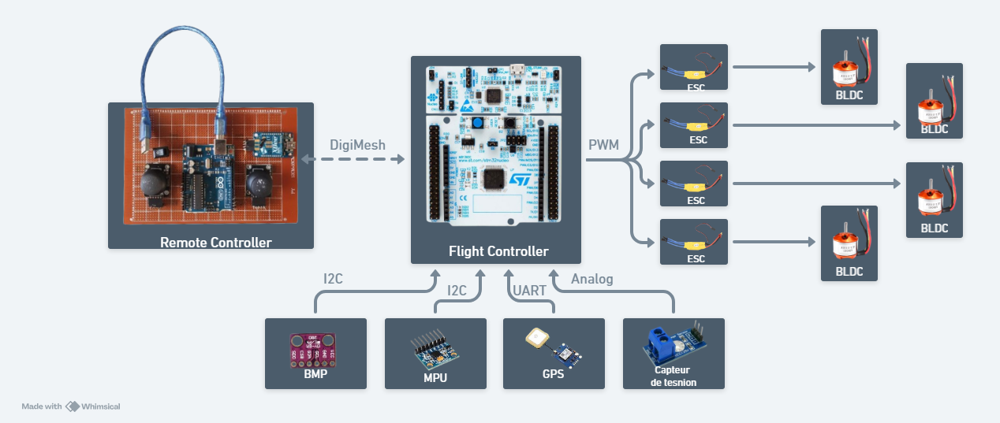
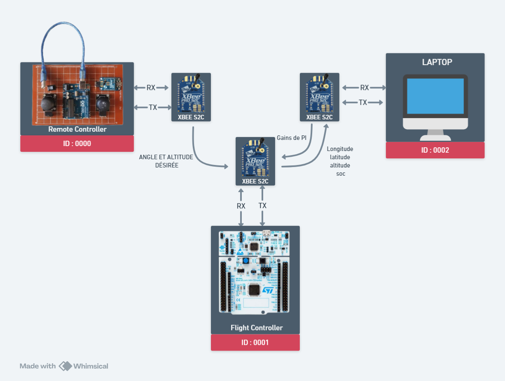
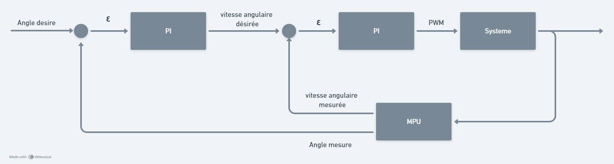

# Drone's Software Development and Hardware Conception 

## A fully functional example project of a Quadcopter conception, including its environment which includes the Remote controller and a user interface (GUI)
This project details the design and creation of an autonomous drone, integrating advanced hardware and software components. The drone is powered by an STM32F4 microcontroller, acting as the control system's core. BLDC motors provide propulsion, and various sensors like the BMP280 for pressure, MPU6050 for acceleration, and a GPS module gather environmental and flight data. Communication is facilitated through an Xbee module. The software architecture includes modules for sensor data acquisition and processing, as well as control algorithms such as PI regulators and cascade techniques, ensuring the drone's stability and maneuverability. The practical implementation involved programming the microcontroller, integrating and calibrating sensors, precisely controlling the motors, and configuring the communication system.

## This repository contains 3 parts 

* The Flight controller folder, which is an STM32CubeIDE project to be uploaded to an STM32F401RE
* The Remote controller folder, which is Arduino Uno code
* A Python script that runs the GUI for useful information and also for automatic flight (to be added)

# Flight Controller 

the brain of the drone is the FC which is based on STM32F401RE microcontroller ,  the stm32f4 took the information from various sensor : BMP, ADC , GPS and mainly the MPU 6050 that an IMU and also the setpoints from the remote controller ,  and then based on these 2 informations the FC compute the duty cycle that needs to go to the brushless motors with the help of a PI  control loop

# Remote Controller

to control properly the Quadcopter an Arduino Uno is mounted on a PCB , with 2 joysticks and an s2c Xbee , when joysticks are updated Aruino uno send new data to drone's FC via Xbee 

# Graphical User Interface 
  We used the  GUI to adjust the PI gains , and also for future automatic control , here the control loop is composed of 2 loops , the inner loop  to control the angular velocity of the brushless and the outer loop is for the angle 

